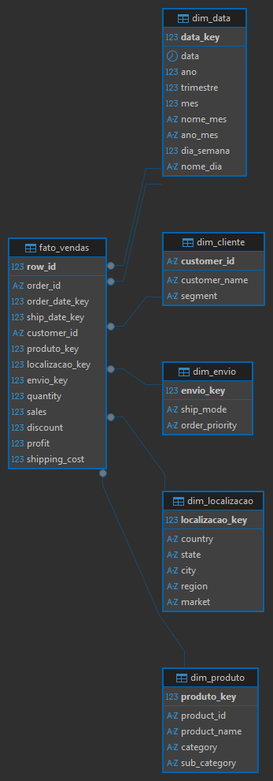
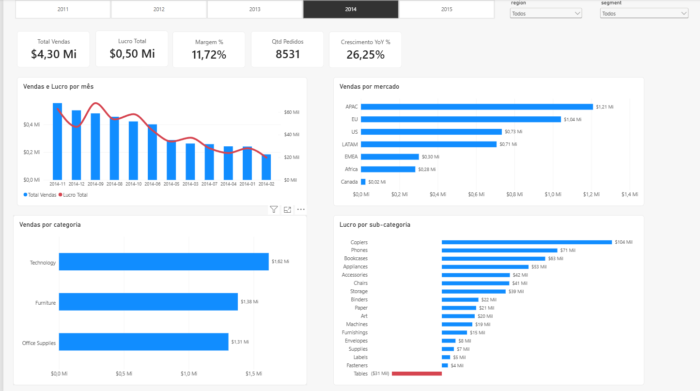

# Global Superstore: Análise SQL e Power BI

Projeto de estudo em SQL sobre o dataset **Global Superstore**, obtido no [Kaggle](https://www.kaggle.com/datasets/fatihilhan/global-superstore-dataset).

A proposta foi trabalhar com uma base de vendas de tamanho razoável do carregamento até a análise, em vez de consultas isoladas sobre tabelas de exemplo. O repositório cobre o caminho completo, do carregamento ao dashboard em Power BI.

---

## Sobre o dataset

O Global Superstore registra vendas de uma varejista fictícia de material de escritório, móveis e tecnologia, com operação global entre 2011 e 2014.

| | |
|---|---|
| Linhas | ~51.290 |
| Pedidos distintos | ~25.000 |
| Período | 2011 a 2014 |
| Granularidade | um registro por **item** de pedido |

A granularidade merece atenção antes de qualquer consulta. Como cada linha é um item e não um pedido, `COUNT(*)` conta itens e `AVG(sales)` devolve a média por item — não por pedido. Métricas em nível de pedido exigem consolidar antes de agregar, e a diferença entre as duas leituras é considerável.

O arquivo também é totalmente desnormalizado: cliente, produto, geografia e transação convivem na mesma linha.

---

## Ambiente

- PostgreSQL 18.4 (local, Windows x86_64)
- DBeaver Community
- Origem: `superstore.csv`
- Power BI Desktop

---

## O problema que custou uma reimportação

Este caso está registrado com algum detalhe por ter sido a parte mais instrutiva do projeto, e por explicar a estrutura dos arquivos aqui.

### O que aconteceu

A primeira carga foi feita do jeito mais direto: apontar o CSV no assistente do DBeaver e deixá-lo criar a tabela. O que não estava evidente é que o assistente infere os tipos a partir de uma **amostra de 100 linhas** — a configuração aparece na tela de confirmação, mas passa despercebida com facilidade.

As primeiras linhas do arquivo não tinham decimal relevante. O assistente concluiu que as colunas monetárias eram inteiras:

```
sales          integer
discount       integer
profit         real
shipping_cost  real
```

### Por que isso estragou a análise

**`sales` e `discount` como `integer`.** Inteiro não guarda casa decimal, então os valores foram truncados já na inserção. O caso de `discount` é o mais grave: trata-se de uma proporção entre 0 e 1, e todos os descontos (0.1, 0.15, 0.2, 0.45...) colapsaram em 0 ou 1. Uma das consultas já escritas filtrava desconto acima de 50% — rodava sobre um dado que não existia mais.

**`profit` e `shipping_cost` como `real`.** O problema aqui é mais sutil. Ponto flutuante binário não representa decimais com exatidão, e somar dezenas de milhares de valores monetários acumula erro de arredondamento. É o mesmo motivo pelo qual planilha com float produz diferença de centavos em conciliação — encontrar o mesmo comportamento dentro de um banco de dados foi o que chamou atenção.

### Como o problema apareceu

```sql
SELECT column_name, data_type
FROM information_schema.columns
WHERE table_name = 'superstore_raw';
```

A consulta foi rodada por outro motivo — verificar se `sales` era `numeric` para usar `ROUND` com duas casas. O diagnóstico veio de carona. Uma verificação logo após a carga teria evitado as consultas escritas em cima de dado corrompido, e foi essa a razão de existir o `02_validacao.sql`.

### Por que `ALTER TABLE` não resolveu

A reação imediata foi tentar converter os tipos. Não funciona: converter `integer` para `numeric` apenas acrescenta zeros, e 2309 vira 2309.00. O que foi truncado não volta, porque a perda ocorreu na inserção e não no armazenamento. A única saída era apagar a tabela e recarregar.

### A solução

Inverter a ordem. Em vez de deixar o assistente criar a tabela, o `CREATE TABLE` vem primeiro, com os tipos definidos, e a importação aponta para a tabela já existente:

```sql
sales          numeric(12,4)
discount       numeric(5,4)
profit         numeric(12,4)
shipping_cost  numeric(12,4)
```

No assistente do DBeaver, a diferença aparece na tela de mapeamento: o destino precisa mostrar `existing` e não `create`. Foi necessário ainda ajustar coluna por coluna, porque o CSV usa ponto nos nomes (`Order.Date`) e a tabela usa underscore (`order_date`) — o casamento automático só funcionou nas colunas de palavra única.

### O que fica

Inferência automática de tipo é conveniente e não é confiável. Definir o schema manualmente leva cinco minutos; descobrir o erro depois custa refazer a carga e revisar tudo que já foi escrito.

---

## Outras decisões

**Nomes de coluna.** O CSV vem em PascalCase separado por ponto (`Customer.ID`, `Ship.Mode`). No PostgreSQL o ponto é separador de esquema, e nome com maiúscula exige aspas duplas em toda consulta, permanentemente. Tudo foi renomeado para `snake_case` ainda no mapeamento.

**A coluna `year`.** O DBeaver insistia em mantê-la entre aspas, o que só fez sentido depois de identificar que `year` é palavra-chave SQL. A coluna foi descartada — o ano sai de `EXTRACT(YEAR FROM order_date)` quando necessário, o que também serve de exercício.

**Colunas descartadas.** Além de `Year`, saíram `Market2`, `weeknum` e uma coluna chamada `记录数`, que se revelou ser "contagem de registros" em chinês, resquício de uma exportação do Tableau. As três primeiras são campos derivados, recalculáveis a partir dos dados originais; a última não tem uso.

**O sufixo `_raw`.** A tabela guarda o CSV como veio, sem tratamento. O sufixo abre espaço para tabelas tratadas ao lado, sem ambiguidade sobre qual é qual.

**Datas como `date`.** Permite subtrair uma data da outra e obter o número de dias diretamente, o que a consulta 10 utiliza. Com as colunas em texto, não funcionaria.

**Ausência de índices.** Com cerca de 51 mil linhas, a tabela cabe em memória e o planejador do PostgreSQL opta por varredura sequencial mesmo quando há índice disponível. Somado a isso, a maioria das consultas aqui é agregação sobre a base inteira, caso em que índice não é utilizado. Criá-los seria adorno, não otimização.

---

## Estrutura

```
.
├── README.md
├── sql/
│   ├── 01_schema.sql
│   ├── 02_validacao.sql
│   ├── 03_consultas.sql          -- consultas sobre a tabela bruta (superstore_raw)
│   ├── 03_consultas_estrela.sql  -- consultas sobre o modelo estrela (schema dw)
│   ├── 04_diagnostico_modelo.sql
│   └── 05_modelo_estrela.sql
├── docs/
│   └── modelo_estrela.png
└── powerbi/
    ├── superstore_dashboard.pbix
    └── img/
```

### Ordem de execução

1. `01_schema.sql` — cria a tabela vazia com os tipos corretos
2. Importar `superstore.csv` pelo DBeaver, mapeando na tabela **existente**
3. `02_validacao.sql` — confere tipos, volume, período e ausência de nulos
4. `03_consultas.sql` — análise sobre a tabela bruta
5. `04_diagnostico_modelo.sql` — confere grão, unicidade de IDs e nulos
6. `05_modelo_estrela.sql` — cria o schema `dw` (recria do zero a cada execução)
7. `03_consultas_estrela.sql` — consultas sobre o modelo estrela (exige o schema `dw` criado no passo 6)

---

## Modelo estrela

O `superstore_raw` permanece intacto. O modelo dimensional fica no schema `dw`, criado por `05_modelo_estrela.sql`. Grão da fato: um item de pedido.

| Tabela            | Tipo      | Chave primária             | Observação                                                        |
| ----------------- | --------- | -------------------------- | ----------------------------------------------------------------- |
| `fato_vendas`     | fato      | `row_id`                   | métricas de venda; `order_id` como dimensão degenerada            |
| `dim_cliente`     | dimensão  | `customer_id`              | somente atributos do cliente                                      |
| `dim_produto`     | dimensão  | `produto_key` (substituta) | chave substituta porque `product_id` não identifica sozinho       |
| `dim_localizacao` | dimensão  | `localizacao_key`          | local de entrega da transação                                     |
| `dim_envio`       | dimensão  | `envio_key`                | modalidade de envio e prioridade do pedido                        |
| `dim_data`        | dimensão  | `data_key` (AAAAMMDD)      | usada duas vezes na fato: data do pedido e data de envio          |


### Diagrama



### Decisões

**DDL explícito, carga depois.** Mesma lição da reimportação: as tabelas são criadas com tipos definidos e populadas com `INSERT ... SELECT`, sem `CREATE TABLE AS`.

**Falha em vez de perda silenciosa.** A carga da fato usa `LEFT JOIN` com colunas de chave `NOT NULL`. Se algum join não casar, o `INSERT` acusa erro em vez de descartar linhas.

**Geografia fora da dimensão de cliente.** O mesmo `customer_id` aparece associado a locais de entrega diferentes: 4.442 clientes têm pedidos entregues em mais de uma combinação de país, estado e cidade. Uma `dim_cliente` com geografia teria mais de uma linha por cliente e quebraria a relação 1:N com a fato. A solução foi tratar o local como atributo da transação: `dim_localizacao` é uma dimensão própria, referenciada pela fato via `localizacao_key`.

---

## Consultas

O repositório tem dois arquivos de consultas:

- `03_consultas.sql` consulta a `superstore_raw`, a tabela desnormalizada. É o ponto de partida, e aqui o filtro e a agregação acontecem sobre a base inteira.
- `03_consultas_estrela.sql` consulta o schema `dw`, juntando a `fato_vendas` às dimensões. 

A tabela abaixo lista as consultas:

| # | Pergunta |
|---|---|
| 1 | Os 10 itens de maior valor de venda |
| 1b | Os 10 pedidos de maior faturamento (versão agregada) |
| 2 | Quantos pedidos distintos existem |
| 3 | Itens vendidos com prejuízo e desconto acima de 50% |
| 4 | Faturamento, lucro e margem por categoria |
| 5 | Subcategorias com prejuízo consolidado |
| 6 | Ticket médio por segmento de cliente |
| 7 | Top 5 países por faturamento, entre os com mais de 100 pedidos |
| 8 | Faturamento por ano |
| 9 | Faturamento mensal de 2014 |
| 10 | Tempo médio de entrega por modalidade de envio |

As consultas 1 e 1b foram mantidas lado a lado justamente porque os resultados não coincidem. A primeira lista os itens mais caros; a segunda, os pedidos de maior valor. É a distinção de granularidade mencionada no início, e confundir as duas é o erro de leitura mais fácil de cometer nessa base.

---

## Achados

**Apenas uma subcategoria opera no vermelho.** `Tables` acumula prejuízo de aproximadamente 64 mil no consolidado global, enquanto todas as demais são lucrativas. A investigação aponta para a combinação de desconto médio elevado com custo de frete alto — coerente com um produto volumoso e pesado.

O que torna esse achado interessante é menos o resultado e mais o caminho: partir de um número fora da curva e decompor por dimensão até encontrar a causa.

---


## Dashboard Power BI

Arquivo: `powerbi/superstore_dashboard.pbix`. Conecta ao PostgreSQL (schema `dw`, modo Import). Valores em dólar.



### Modelo

- Cinco dimensões ligadas à `fato_vendas` em relacionamentos 1:N, com filtro da dimensão para a fato.
- - `dim_data` tem dois relacionamentos com a `fato_vendas`: um ativo, pela data do pedido, e um inativo, reservado para análises por data de envio. Todas as medidas usam a data do pedido.
- A `superstore_raw` não entra no modelo.

### Medidas (DAX)

`Total Vendas`, `Lucro Total`, `Margem %`, `Qtd Pedidos`, `Ticket Médio`, `Vendas Ano Anterior` e `Crescimento YoY %`. O YoY só é confiável com um ano selecionado.

### Página 1: visão executiva

Segmentações (ano, região, segmento), cinco KPIs, vendas e lucro por mês, vendas por mercado, vendas por categoria e lucro por subcategoria (deficitárias em vermelho).

### Como abrir

O arquivo aponta para `localhost`. Para reproduzir o banco, siga a [ordem de execução](#ordem-de-execução), que inclui a importação do CSV entre os scripts `01` e `02`, e termine no `05_modelo_estrela.sql`, que cria o schema `dw`.

Depois, no Power BI, ajuste servidor, banco (`superstore`) e credenciais em **Transformar dados → Configurações da fonte de dados**.

---

## Próximos passos

- Consultas com window functions (`ROW_NUMBER`, `LAG`, running total)
- Páginas 2 e 3 do dashboard (produtos e rentabilidade; geografia e clientes)

---

## Fonte

[Global Superstore Dataset](https://www.kaggle.com/datasets/fatihilhan/global-superstore-dataset), publicado por Fatih Ilhan no Kaggle.

Existem várias versões do Global Superstore circulando, com conjuntos de colunas diferentes. Esta traz `Year`, `Market2`, `weeknum` e a coluna `记录数`, todas descartadas aqui. Os scripts assumem essa versão — outra origem provavelmente exige ajuste no `01_schema.sql`.

Dados fictícios, destinados a estudo e demonstração.
